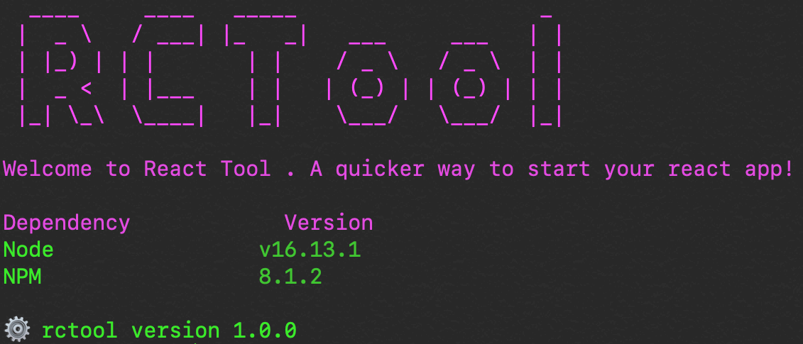

## RCTool

This is helper command line tool to help you to create ReactJs project with minimal effort. You just need to install this package globally in your system and voila, you're good to go.

#### Installation
To install this package, please run bellow commands
```bash
npm i -g @ravi448/rctool
yarn add global @ravi448/rctool
```
Once you're done with global installation, open a new terminal and check if everything is good. Check the package version using
```bash
rctool -v
```
This must return 


## Usage

This package require minimum effort from you to complete the project setup.
1. To start a new project, run 
```bash 
rctool init [project_name]
```
2. Answer the questions asked by CLI and press enter
3. After final answer, it'll start project creation and withing 2 minute, you'll be ready to write code in the project.

***Some of the options may not work as of now, it is still in development***